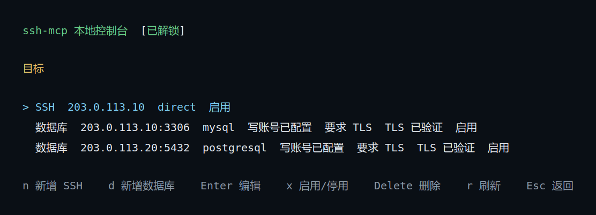
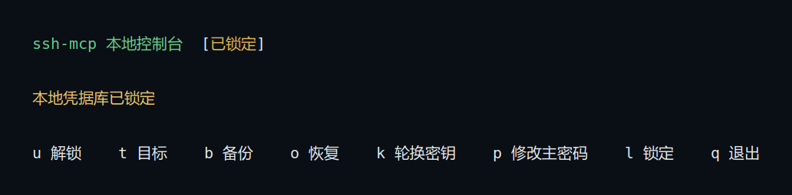
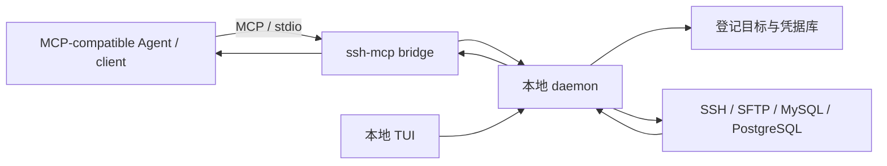

# ssh-mcp

[](LICENSE)

**Local SSH MCP server for MCP-compatible agents | 面向 AI 运维的本地 MCP 桥接服务**

`ssh-mcp` 是一个可供 **支持 MCP 的 AI Agent/客户端使用的本地 SSH MCP server**，通过 **Model Context Protocol (MCP) over stdio** 让 AI 使用你在本机登记的 Linux SSH 主机、MySQL/MariaDB 和 PostgreSQL 数据库，完成排障、查询、文件查看和文件部署。

它不是云端代理，也不监听 HTTP/TCP 服务端口。目标、连接凭据和主机指纹由本地守护进程管理；用户通过 TUI 登记目标，MCP 客户端通过 stdio 调用已登记目标。

## 界面预览



*本地控制台示例，画面中的地址和账号为文档演示数据。*



*凭据库锁定时的本地管理界面。*

## 为什么使用

- **一个入口完成日常运维**：SSH 命令、SQL、受限文件读取、文件部署和 SSH 工作会话都通过 MCP 提供。
- **目标明确**：只能访问本地登记且启用的目标，不扫描网络，也不会把凭据交给 AI 或 MCP 客户端。
- **安全边界清楚**：常规运维请求直接执行；格式化磁盘、破坏系统目录、无条件批量写入等固定高危类别在派发前拦截；每个 SSH 目标还可以配置正则黑名单。
- **部署可核验**：文件部署先校验大小和 SHA-256，再创建临时文件、备份现有文件并激活新文件；结果未知时保留核验和人工恢复所需的信息，不会自动重试。
- **本地跨平台**：程序可运行在 Linux、macOS 和 Windows；远端 SSH 当前支持 Linux 命令语义。

## 工作原理



`serve` 是 MCP 客户端使用的 stdio bridge。它按需连接或启动本机 daemon；daemon 独占本地状态、凭据和远程连接。`manage` 打开 TUI，用于解锁凭据库、登记目标和执行备份。远端结果以结构化 MCP 数据返回，并标记为不可信远端输出。

## 快速开始

### 通过 AI 自动安装

把下面这句话发送给一个具备终端和文件操作权限、并能配置本地 MCP server 的 Agent：

```bash
请从 https://github.com/lswzw/ssh-mcp/releases/latest 下载适合当前系统和架构的 ssh-mcp 预编译版本，放到稳定路径并注册为当前 MCP 客户端的 stdio server（启动参数为 serve），完成后验证工具列表；如果客户端不支持本地 stdio，或需要主密码、目标登记、主机指纹确认，请提示我手动完成。
```

首次使用仍需在本地 TUI 中设置主密码、登记目标并确认 SSH 主机指纹；只有支持启动本地 stdio MCP server 的客户端可以直接接入。

### 手工安装或编译方法

发布页提供预编译版本时，下载与本机平台匹配的文件即可；文件名和下载地址见 [安装与运行](docs/installation.md)。没有匹配版本时再从源码编译。

需要 Go `1.26.5`、一个支持 stdio MCP 的 Agent/客户端，以及一个可打开交互终端的本地桌面环境。

```bash
git clone https://github.com/lswzw/ssh-mcp.git
cd ssh-mcp
make build
./bin/ssh-mcp manage
```

首次打开 TUI 时设置主密码，然后添加并验证 SSH 或数据库目标。验证完成后，按所用 Agent/客户端的配置格式接入 stdio MCP server。通用配置契约如下（字段名可能因客户端而异）：

```text
transport: stdio
command: /absolute/path/to/bin/ssh-mcp
args: ["serve"]
```

下面是 Codex CLI 的注册示例：

```bash
codex mcp add ssh-mcp -- "$PWD/bin/ssh-mcp" serve
codex mcp get ssh-mcp
```

在所用 Agent/客户端的任务中明确说明“使用 ssh-mcp”，例如：

```text
使用 ssh-mcp 检查已登记生产主机的磁盘空间，并报告占用最高的目录。
```

完整步骤见 [快速开始](docs/quickstart.md)，工具参数见 [MCP 工具参考](docs/mcp-tools.md)。

## 支持范围

| 范围 | 支持内容 |
| --- | --- |
| 本地宿主机 | Linux、macOS、Windows |
| 远端 SSH | 登记的 IP、直连账号密码、已确认主机指纹；远端命令按 Linux 语义执行 |
| 数据库 | MySQL/MariaDB、PostgreSQL，使用 `IP:端口` 登记 |
| 认证方式 | SSH 当前为密码认证；数据库分别配置只读账号和可选可写账号 |
| MCP 客户端 | 支持启动本地 stdio MCP server 的 Agent/客户端；Codex CLI 仅作为配置示例 |
| MCP 传输 | stdio；本地 daemon 使用操作系统本地 IPC |

SSH 私钥/agent、远端 Windows 或 macOS 命令语义、交互式 TTY、独立或持久端口转发和未登记目标不在当前支持范围内；命令中的静态 SSH 转发仍须指向已登记目标并通过策略检查，动态转发会被拒绝。

## 文档

- [文档目录](docs/README.md)
- [快速开始](docs/quickstart.md)
- [使用指南](docs/usage.md)
- [安装与运行](docs/installation.md)
- [目标配置](docs/configuration.md)
- [MCP 工具参考](docs/mcp-tools.md)
- [安全模型与限制](docs/security-model.md)
- [日常维护](docs/operations.md)
- [工作原理与架构](docs/architecture.md)
- [参与贡献](docs/contributing.md)
- [开源发布清单](docs/open-source-release.md)

## 许可证

本项目使用 [GNU General Public License v3.0](LICENSE) 发布。
