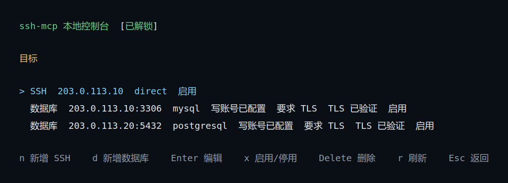
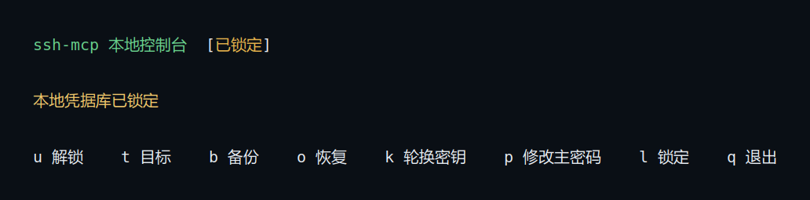

# ssh-mcp

[](LICENSE)
[](https://modelcontextprotocol.io/)

[English](README_EN.md) | [中文说明](README.md)

**Security-First Local SSH & Database MCP Server for AI Agents**

`ssh-mcp` is a secure, local [Model Context Protocol (MCP)](https://modelcontextprotocol.io/) server that bridges AI coding assistants (Claude Desktop, Cursor, Codex CLI, Cline, Windsurf, etc.) to your Linux SSH hosts, MySQL/MariaDB, and PostgreSQL databases via **MCP over stdio**.

It enables AI agents to execute troubleshooting commands, inspect log files, query databases, and deploy application binaries safely—**without ever exposing passwords or private keys to the LLM, and without granting unchecked access to your infrastructure.**

> [!IMPORTANT]
> `ssh-mcp` is **100% local-first**. It is not a cloud proxy and never listens on open HTTP/TCP network ports. Target credentials, host fingerprints, and authorization policies are managed exclusively by a local daemon and configured through an interactive local Terminal User Interface (TUI).

---

## Console Preview


*Local TUI management console (demonstration data).*


*Local master password unlock screen protecting the credential vault.*

---

## Why ssh-mcp? (Security Architecture)

Giving an LLM unconstrained terminal access (`bash` or raw `ssh`) is dangerous: a single hallucination or malicious prompt injection can result in `rm -rf /`, dropped production databases, leaked credentials, or unauthorized lateral network movement. 

`ssh-mcp` is engineered from the ground up as a **security control plane** between AI agents and your infrastructure.

### The 5 Security Pillars

1. 🛡️ **Zero Credential Exposure**: Plaintext passwords, master passwords, and database credentials are encrypted at rest in a local vault. The AI agent and MCP client **never** see, receive, or handle credentials.
2. 🚫 **11 Built-in Pre-Dispatch Hard Guardrails**: Destructive commands and high-risk operations are analyzed and intercepted locally by the daemon *before* reaching the network:
   - **System destruction**: Blocks `rm -rf /`, `/boot`, `/etc`, `/usr`, `/proc`, etc. (`base_system_tree_destruction`).
   - **Disk destruction**: Blocks formatting, partitioning, and raw block device overwrites (`format_or_partition`, `raw_block_device_write`).
   - **Dangerous database changes**: Intercepts `DROP DATABASE/TABLE`, `TRUNCATE`, `ALTER ... DROP`, and unconditional `UPDATE`/`DELETE` without `WHERE` clauses.
   - **Opaque shell payloads**: Rejects `eval`, `source`, `curl | sh`, dynamic substitutions, and base64-encoded executions (`opaque_shell_effect`).
   - **Lateral movement**: Strictly blocks nested SSH/SCP/SFTP hops or unauthorized port forwards to unregistered IPs (`unregistered_remote_hop`).
3. 🎯 **Strict Target Whitelisting & Fingerprint Pinning**: The agent cannot scan subnets or connect to arbitrary IPs. It can only interact with explicitly enabled targets registered by you in the local TUI. SSH host keys are pinned upon registration and strictly verified against MITM attacks on every connection.
4. 📦 **Atomic & Verified Deployments**: Binary updates (`deploy_ssh_binary`) validate file size and SHA-256 pre-flight, stage to a temporary file, create an automated rollback backup of existing binaries, and perform an atomic activation. Ambiguous outcomes trigger an alert without blind auto-retries.
5. 🔒 **Untrusted Remote Output Isolation**: All remote stdout/stderr and query results are treated as untrusted inputs, preventing remote outputs from altering daemon authorization or bypassing policy boundaries.

### Comparison: ssh-mcp vs. Generic Bash / Naive SSH MCP Tools

| Security Dimension | Naive Bash / SSH Tools | `ssh-mcp` Control Plane |
| :--- | :--- | :--- |
| **Credential Handling** | Passed in environment variables or prompts | **Zero-exposure local encrypted vault** |
| **Host Key Verification** | Disabled (`StrictHostKeyChecking=no`) or ignored | **Host key fingerprint pinned and verified** |
| **Blast Radius Protection** | None; hallucinated `rm -rf` executes immediately | **11 hard-coded pre-dispatch guardrails** |
| **Target Boundary** | Any reachable IP/hostname | **Strict local whitelist; no lateral hopping** |
| **Database Safeguards** | Full read/write connection string exposed | **Segregated read-only/read-write + query guardrails** |
| **File Deployment** | Unchecked blind overwrite via `scp` or `echo` | **Pre-flight SHA-256 + atomic swap + auto-backup** |
| **Custom Restrictions** | Complex shell wrappers required | **Per-target regex command blacklists** |

---

## Architecture & How It Works

```mermaid
flowchart LR
    C["MCP Agent / Client<br/>(Claude, Cursor, Codex, etc.)"] -->|MCP / stdio| B["ssh-mcp serve<br/>(stdio bridge)"]
    B -->|Local IPC| D["Local Daemon"]
    U["Local TUI Console<br/>(ssh-mcp manage)"] -->|Local IPC| D
    D --> S[("Local Encrypted Vault<br/>& Target Registry")]
    D -->|SSH / SFTP| R1["Linux SSH Hosts"]
    D -->|SQL (TLS / Plaintext)| R2["MySQL / PostgreSQL"]
```

- **`serve`**: The stdio MCP bridge invoked by your AI client. It automatically spawns or connects to the local daemon via OS-level IPC (Unix socket or named pipe).
- **`manage`**: Opens the interactive TUI console to set the master password, register hosts, and test connections.
- **Local Daemon**: Controls the encrypted vault, validates pre-dispatch safety rules, pins SSH host keys, and brokers all connections.

---

## Quickstart

### Option 1: AI-Assisted Automated Setup

Copy and paste the following instruction into any AI agent with terminal execution capabilities (e.g., Claude Code, Cursor terminal, Codex CLI):

```text
Please download the latest prebuilt release of ssh-mcp for the current operating system and architecture from https://github.com/lswzw/ssh-mcp/releases/latest. Place the binary in a permanent path (e.g., ~/.local/bin or current project bin/) and register it as an MCP stdio server with command argument "serve". Verify the MCP tool list once registered. If master password setup, target registration, or SSH host key confirmation is required, prompt me to complete it in the local TUI console.
```

### Option 2: Manual Installation & Build

#### Prerequisites
- Local OS: Linux, macOS, or Windows.
- Go `1.26.5` (if compiling from source).
- An MCP-compatible client supporting stdio servers (Claude Desktop, Cursor, Codex CLI, etc.).
- A terminal with interactive TTY support for initial setup.

#### 1. Build the Binary
```bash
git clone https://github.com/lswzw/ssh-mcp.git
cd ssh-mcp
make build
```
The compiled binary will be placed at `./bin/ssh-mcp` (or `./bin/ssh-mcp.exe` on Windows).

#### 2. Configure Targets in the TUI Console
Launch the local console:
```bash
./bin/ssh-mcp manage
```
Follow the on-screen keys:
1. Press `u` to set a master password and unlock the credential vault (this initializes the local database on first run).
2. Press `t` to open the Targets list.
3. Press `n` to add an SSH host, or `d` to add a database target.
4. Enter target credentials and press `Ctrl+S`. `ssh-mcp` will test connectivity.
5. For SSH hosts, verify the displayed host fingerprint and press `y` to confirm and pin it.
6. Press `Esc` to return and `q` to exit.

---

## MCP Client Configuration

Connect `ssh-mcp` to your favorite MCP client using the standard stdio contract:

- **Transport**: `stdio`
- **Command**: `/absolute/path/to/bin/ssh-mcp`
- **Arguments**: `["serve"]`

### Claude Desktop
Add the following to your `claude_desktop_config.json`:
- **macOS**: `~/Library/Application Support/Claude/claude_desktop_config.json`
- **Windows**: `%APPDATA%\Claude\claude_desktop_config.json`
- **Linux**: `~/.config/Claude/claude_desktop_config.json`

```json
{
  "mcpServers": {
    "ssh-mcp": {
      "command": "/absolute/path/to/ssh-mcp/bin/ssh-mcp",
      "args": ["serve"]
    }
  }
}
```

### Cursor / VS Code (Cline, Roo Code)
Configure as a custom stdio MCP server:
```json
{
  "mcpServers": {
    "ssh-mcp": {
      "command": "/absolute/path/to/ssh-mcp/bin/ssh-mcp",
      "args": ["serve"]
    }
  }
}
```

### Codex CLI
```bash
codex mcp add ssh-mcp -- "$PWD/bin/ssh-mcp" serve
codex mcp get ssh-mcp
```

*(Optional)* If the local daemon needs to open an external terminal window for interactive unlocking during agent sessions, specify the terminal launcher:
```bash
# Example for Linux GNOME environments
codex mcp add ssh-mcp --env SSH_MCP_TERMINAL=gnome-terminal -- "$PWD/bin/ssh-mcp" serve
```

---

## Example AI Prompts

Once registered, you can direct your AI agent to use `ssh-mcp`:

```text
Use ssh-mcp to list registered targets, check available disk space on the production server (203.0.113.10), and summarize which directories consume the most storage.
```

```text
Using ssh-mcp, query the replica database for the top 5 slowest queries recorded in the slow query log table today.
```

---

## Tool Reference Overview

`ssh-mcp` exposes a concise, powerful set of MCP tools:

| Tool Name | Scope | Description |
| :--- | :--- | :--- |
| `list_targets` | Discovery | Lists registered SSH and database targets with status and capabilities. |
| `describe_target_capability` | Discovery | Inspects allowed operations (file transfer, writable DB, session support). |
| `run_ssh_command` | SSH Execution | Executes a non-interactive Linux command on a target host subject to guardrails. |
| `create_ssh_work_session` | SSH Session | Initializes a dedicated working session maintaining remote state/directory. |
| `run_ssh_session_command` | SSH Session | Runs a command inside an active SSH working session. |
| `close_ssh_work_session` | SSH Session | Explicitly closes an active working session. |
| `read_ssh_file` | SFTP / File | Securely reads single regular files (logs, configs) with path normalization. |
| `deploy_ssh_binary` | SFTP / Deploy | Atomic binary deployment with SHA-256 pre-check and auto-rollback backup. |
| `query_database` | SQL | Executes read-only or authorized write queries on MySQL/MariaDB or PostgreSQL. |

For detailed parameters, schemas, and return formats, see [MCP Tools Reference](docs/en/mcp-tools.md).

---

## Supported Environments & Scope

| Category | Supported Features & Limits |
| :--- | :--- |
| **Local Host OS** | Linux (x86_64, arm64), macOS (Apple Silicon, Intel), Windows (x86_64) |
| **Remote SSH Targets** | Linux OS semantics; IP address targets; password authentication; pinned host fingerprints |
| **Database Targets** | MySQL 5.7+ / 8.0+, MariaDB 10.3+, PostgreSQL 12+; TLS-verified or legacy plaintext |
| **Transport** | MCP stdio; local inter-process communication via Unix domain sockets / named pipes |
| **Out of Scope** | SSH private keys/agent forwarding, remote Windows/macOS semantics, interactive TTY, dynamic SSH tunnels (`-D`) |

---

## English Documentation

- [English Documentation Index](docs/en/README.md)
- [Quickstart Guide](docs/en/quickstart.md)
- [Installation & Runtime Guide](docs/en/installation.md)
- [Target & Vault Configuration](docs/en/configuration.md)
- [MCP Tools Reference](docs/en/mcp-tools.md)
- [Security Model & Guardrails](docs/en/security-model.md)

*(For Chinese documentation, please refer to [docs/README.md](docs/README.md))*

---

## Contributing & Security

- Contributions are welcome! Please read [CONTRIBUTING.md](CONTRIBUTING.md) before submitting Pull Requests.
- For security vulnerabilities, please refer to our [Security Policy](SECURITY.md) and report via GitHub Private Vulnerability Reporting.

---

## License

This project is licensed under the [GNU General Public License v3.0](LICENSE).
