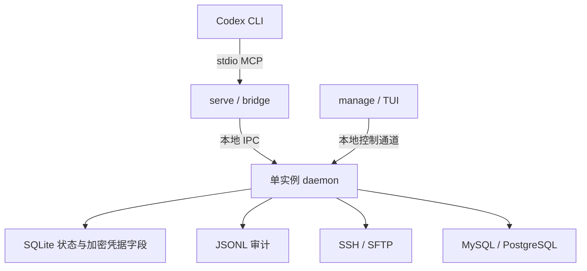

# 工作原理与架构

## 组件关系



### `serve` / bridge

`serve` 为每个 Codex MCP 会话提供一条 stdio 管道。它不直接持有目标凭据，也不监听网络端口。首次实际工具调用时，bridge 会连接现有 daemon；没有 daemon 时按需启动一个。

### daemon

daemon 是本机唯一的状态和远程执行边界，负责：

- 打开并维护本地 SQLite 状态；
- 在内存中保存解锁后的数据密钥；
- 检查目标、凭据、主机指纹和固定拦截规则；
- 管理 SSH、SFTP、MySQL 和 PostgreSQL 连接；
- 为工具返回结构化结果并写入本地审计。

daemon 默认在实际空闲一小时后退出。退出、锁定或密钥维护会清除内存凭据和 SSH 工作会话。

### TUI

`manage` 通过本地受控通道启动独立 TUI。TUI 是目标和凭据的唯一配置入口，负责主密码、目标验证、指纹确认、黑名单、文件操作开关、备份和密钥维护。MCP 工具无法调用这些管理操作。

## 一次请求的流程

```text
Codex 工具请求
    -> bridge 转发
    -> daemon 读取登记目标
    -> 检查解锁状态、目标状态、预算和本地策略
    -> 通过对应 SSH/SFTP/数据库连接派发（或在本地拒绝）
    -> 返回结构化结果并尽力写入审计
```

普通 SSH 命令和 SQL 是独立操作。SSH 工作会话只保存声明式工作目录和非机密环境变量，不保存远端 Shell 的原始状态。文件读取和部署走受限的 SFTP 接口，不共享任意 Shell 文件操作。

## 本地文件布局

```text
<程序目录>/state.db
<程序目录>/audit.log
<程序目录>/instance.lock
<程序目录>/.ssh-mcp-runtime/
```

`state.db` 保存目标、凭据引用和配置元数据；敏感凭据字段单独加密封装。`.ssh-mcp-runtime/` 只保存运行期间可重建的本地 endpoint 和进程信息。Linux/macOS 使用 Unix socket，Windows 使用 named pipe。

## 连接与结果

SSH 连接绑定目标配置和已确认主机指纹；数据库连接根据目标配置选择只读或可写账号及传输策略。连接中断后，daemon 会区分“尚未派发”和“已派发但结果未知”，不会把二者混为一谈，也不会自动重放未知操作。
